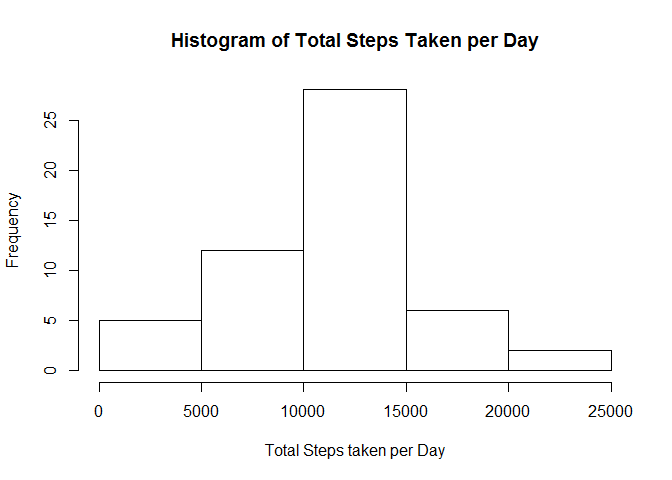
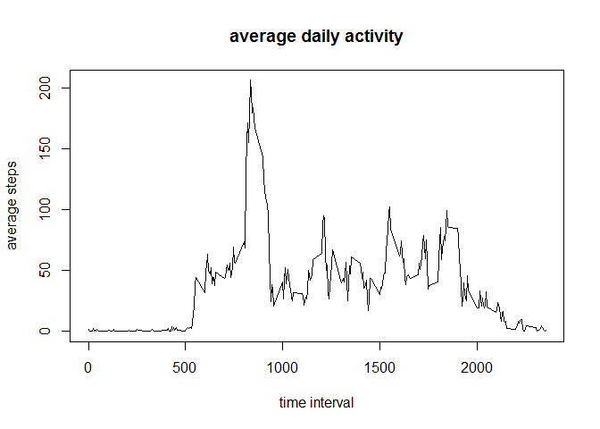
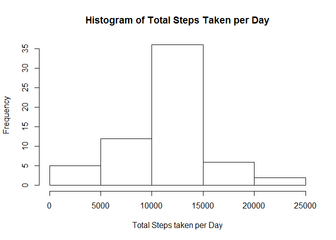
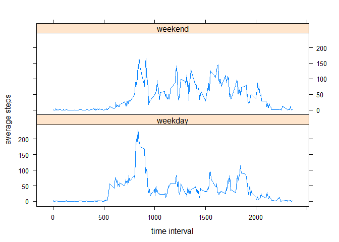

# Reproducible Research: Peer Assessment 1


## Loading and preprocessing the data


```r
activityData <- read.csv("activity/activity.csv")
activityData$date <- as.Date(activityData$date)
```

## Mean Total number of steps taken per day?


```r
totalSteps <- aggregate(steps ~ date, data = activityData, sum, na.rm = T)
hist(totalSteps$steps, xlab = "Total Steps taken per Day", main = "Histogram of Total Steps Taken per Day")
```

 

```r
stepsMean <- mean(totalSteps$steps)
stepsMedian <- median(totalSteps$steps)

print (paste("Mean = ", stepsMean))
```

```
## [1] "Mean =  10766.1886792453"
```

```r
print (paste("Median = ", stepsMedian))
```

```
## [1] "Median =  10765"
```

## What is the average daily activity pattern?

```r
averageSteps <- aggregate(steps ~ interval, data = activityData, FUN = mean, na.rm = T)
plot(averageSteps$interval, averageSteps$steps, type = "l", xlab = "time interval", ylab = "average steps",  main = "average daily activity")
```

 

```r
maxNumStep <- averageSteps[which.max(averageSteps$steps), ]$interval
print(paste("Max Number Step Interval = ", maxNumStep))
```

```
## [1] "Max Number Step Interval =  835"
```

## Imputing missing values

```r
totalNumNA <- sum(is.na(activityData$steps))
print(paste("total number of missing values = ", totalNumNA))
```

```
## [1] "total number of missing values =  2304"
```

```r
newActivityData <- activityData
for (i in 1:nrow(activityData)) {
    if (is.na(newActivityData[i,]$steps)) {
        newActivityData[i,]$steps <- averageSteps[which(averageSteps$interval == newActivityData[i,]$interval), ]$steps
    }
}

newTotalSteps <- aggregate(steps ~ date, data = newActivityData, sum, na.rm = T)
hist(newTotalSteps$steps, xlab = "Total Steps taken per Day", main = "Histogram of Total Steps Taken per Day")
```

 

```r
newStepsMean <- mean(newTotalSteps$steps)
newStepsMedian <- median(newTotalSteps$steps)

print (paste("Mean = ", newStepsMean))
```

```
## [1] "Mean =  10766.1886792453"
```

```r
print (paste("Median = ", newStepsMedian))
```

```
## [1] "Median =  10766.1886792453"
```

## Are there differences in weekdays and weekends?

```r
weekActivityData <- newActivityData
weekActivityData$week <- NA

for (i in 1:nrow(weekActivityData)) {
    if (weekdays(weekActivityData[i,]$date) == "Saturday" || weekdays(weekActivityData[i,]$date) == "Sunday")
        weekActivityData[i,]$week <- "weekend"
    else
        weekActivityData[i,]$week <- "weekday"
}

weekAverageSteps <- aggregate(steps ~ interval + week, weekActivityData, mean)

library(lattice)
xyplot(steps ~ interval | week, data = weekAverageSteps, layout = c(1,2), type = "l", xlab = "time interval", ylab = "average steps")
```

 

